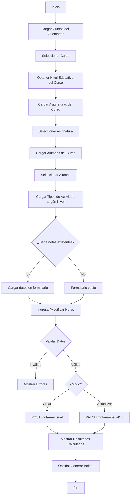

# 📚 GUÍA COMPLETA: Sistema de Ingreso de Notas - Frontend

## 📋 Tabla de Contenido

1. [Descripción General del Flujo](#1-descripción-general-del-flujo)
2. [Flujo Paso a Paso](#2-flujo-paso-a-paso)
3. [Endpoints Disponibles](#3-endpoints-disponibles)
4. [Implementación Detallada](#4-implementación-detallada)
5. [Validaciones Frontend](#5-validaciones-frontend)
6. [Actualización de Notas](#6-actualización-de-notas)
7. [Reportes y Boletas](#7-reportes-y-boletas)
8. [Ejemplos de Código](#8-ejemplos-de-código)
9. [Manejo de Errores](#9-manejo-de-errores)
10. [FAQs y Mejores Prácticas](#10-faqs-y-mejores-prácticas)

---

## 1. Descripción General del Flujo

### **Objetivo:**

Permitir a los orientadores ingresar y gestionar las notas de evaluación de sus alumnos de manera eficiente, con validación automática según el nivel educativo (BÁSICA o BACHILLERATO).

### **Flujo Completo:**

```
1. Cargar cursos asignados al orientador (con validación de grado académico)
2. Seleccionar curso → Obtener nivel educativo del curso
3. Cargar asignaturas del orientador para ese curso
4. Seleccionar asignatura
5. Cargar listado de alumnos del curso
6. Seleccionar alumno
7. Cargar tipos de evaluación según nivel educativo
8. Ingresar notas de actividades y exámenes
9. Guardar (backend calcula automáticamente)
10. Mostrar resultados calculados
11. Permitir modificación (PATCH)
12. Generar reportes y boletas
```

---

## 2. Flujo Paso a Paso

### **Paso 1: Cargar Cursos Asignados al Orientador**

**Endpoint:**

```
GET /cursos/mis-cursos
Headers: Authorization: Bearer {token}
```

**¿Qué hace el backend?**

- Obtiene el `id` del usuario del token JWT
- Si es Admin/P.A → devuelve todos los cursos
- Si es Orientador → devuelve solo sus cursos asignados

**Respuesta Ejemplo:**

```json
[
  {
    "id_curso": 1,
    "nombre": "1º Grado A",
    "seccion": "A",
    "gradoAcademico": {
      "id_grado_academico": 1,
      "nombre": "Primaria",
      "nivel_educativo": "BASICA"
    },
    "orientador": {
      "id_orientador": 1,
      "nombre": "Juan",
      "apellido": "Pérez"
    }
  },
  {
    "id_curso": 15,
    "nombre": "1º Bachillerato A",
    "seccion": "A",
    "gradoAcademico": {
      "id_grado_academico": 4,
      "nombre": "Bachillerato",
      "nivel_educativo": "BACHILLERATO"
    },
    "orientador": {
      "id_orientador": 1,
      "nombre": "Juan",
      "apellido": "Pérez"
    }
  }
]
```

**Frontend debe hacer:**

```typescript
const response = await fetch('/cursos/mis-cursos', {
  headers: { Authorization: `Bearer ${token}` },
});
const cursos = await response.json();

// Renderizar dropdown
cursos.forEach((curso) => {
  console.log(
    `${curso.nombre} - ${curso.gradoAcademico.nombre} (${curso.gradoAcademico.nivel_educativo})`,
  );
});
```

---

### **Paso 2: Obtener Nivel Educativo del Curso Seleccionado**

**¿Por qué es necesario?**
El nivel educativo determina:

- Qué tipos de actividades mostrar
- Qué sistema de cálculo aplicar (70/30 vs 6 componentes)
- Qué exámenes son requeridos

**Endpoint:**

```
GET /cursos/:id_curso/nivel-educativo
```

**Respuesta:**

```json
{
  "id_curso": 1,
  "nombre_curso": "1º Grado A",
  "id_grado_academico": 1,
  "nombre_grado": "Primaria",
  "nivel_educativo": "BASICA"
}
```

**Frontend debe hacer:**

```typescript
const cursoId = 1; // ID seleccionado del dropdown
const response = await fetch(`/cursos/${cursoId}/nivel-educativo`);
const { nivel_educativo } = await response.json();

// Guardar en estado
setNivelEducativo(nivel_educativo); // "BASICA" o "BACHILLERATO"
```

---

### **Paso 3: Cargar Asignaturas del Curso**

**Endpoint:**

```
GET /asignaturas/curso/:idCurso
```

**Respuesta:**

```json
[
  {
    "id_asignatura": 1,
    "nombre": "Matemática I",
    "id_curso": 1,
    "id_orientador": 1,
    "orientador": {
      "nombre": "Juan",
      "apellido": "Pérez"
    }
  },
  {
    "id_asignatura": 2,
    "nombre": "Lenguaje y Literatura",
    "id_curso": 1,
    "id_orientador": 1,
    "orientador": {
      "nombre": "Juan",
      "apellido": "Pérez"
    }
  }
]
```

**Frontend debe hacer:**

```typescript
const response = await fetch(`/asignaturas/curso/${cursoId}`);
const asignaturas = await response.json();

// Renderizar segundo dropdown
asignaturas.forEach((asig) => {
  console.log(`${asig.nombre} - Prof. ${asig.orientador.nombre}`);
});
```

---

### **Paso 4: Cargar Alumnos del Curso**

**Endpoint:**

```
GET /cursos/:id/alumnos
```

**Respuesta:**

```json
[
  {
    "id_alumno": 1,
    "nombre": "Carlos",
    "apellido": "García"
  },
  {
    "id_alumno": 2,
    "nombre": "María",
    "apellido": "López"
  }
]
```

**Frontend debe hacer:**

```typescript
const response = await fetch(`/cursos/${cursoId}/alumnos`);
const alumnos = await response.json();

// Renderizar lista de alumnos
alumnos.forEach((alumno) => {
  console.log(`${alumno.apellido}, ${alumno.nombre}`);
});
```

---

### **Paso 5: Cargar Tipos de Actividad Según Nivel Educativo**

**Endpoint:**

```
GET /sistema-evaluacion/catalogo/tipos-actividad/:nivel_educativo
```

**Parámetros:**

- `nivel_educativo`: "BASICA" | "BACHILLERATO" (obtenido en Paso 2)

**Respuesta para BÁSICA:**

```json
[
  {
    "id_tipo_actividad": 1,
    "nombre": "Tarea",
    "categoria": null,
    "peso": null,
    "activo": true,
    "orden": 1,
    "nivel_educativo": "BASICA",
    "permite_multiples_instancias": true
  },
  {
    "id_tipo_actividad": 2,
    "nombre": "Revisión de libros y cuadernos",
    "categoria": null,
    "peso": null,
    "activo": true,
    "orden": 2,
    "nivel_educativo": "BASICA",
    "permite_multiples_instancias": false
  },
  {
    "id_tipo_actividad": 3,
    "nombre": "Laboratorio escrito",
    "categoria": null,
    "peso": null,
    "activo": true,
    "orden": 3,
    "nivel_educativo": "BASICA",
    "permite_multiples_instancias": true
  }
]
```

**Respuesta para BACHILLERATO:**

```json
[
  {
    "id_tipo_actividad": 5,
    "nombre": "Actividad Integradora",
    "categoria": "ACTIVIDAD_INTEGRADORA",
    "peso": 0.25,
    "activo": true,
    "orden": 1,
    "nivel_educativo": "BACHILLERATO",
    "permite_multiples_instancias": false
  },
  {
    "id_tipo_actividad": 7,
    "nombre": "Tarea",
    "categoria": "TAREA",
    "peso": 0.05,
    "activo": true,
    "orden": 2,
    "nivel_educativo": "BACHILLERATO",
    "permite_multiples_instancias": true
  }
]
```

**Frontend debe hacer:**

```typescript
const response = await fetch(
  `/sistema-evaluacion/catalogo/tipos-actividad/${nivel_educativo}`,
);
const tiposActividad = await response.json();

// Agrupar por categoría si es Bachillerato
if (nivel_educativo === 'BACHILLERATO') {
  const grouped = tiposActividad.reduce((acc, tipo) => {
    const cat = tipo.categoria || 'SIN_CATEGORIA';
    if (!acc[cat]) acc[cat] = [];
    acc[cat].push(tipo);
    return acc;
  }, {});
}
```

---

### **Paso 6: Verificar si el Alumno ya tiene Notas Ingresadas**

**Endpoint:**

```
GET /sistema-evaluacion/notas-mensuales/:id_alumno/:id_asignatura?trimestre={trimestre}&anio_academico={anio}
```

**Respuesta:**

```json
[
  {
    "id_nota_mensual": 123,
    "mes": "Febrero",
    "trimestre": 1,
    "anio_academico": "2025",
    "actividades": [
      {
        "id_actividad_evaluacion": 456,
        "id_tipo_actividad": 1,
        "tipo_actividad_nombre": "Tarea",
        "numero_actividad": 1,
        "nota": 8.0
      }
    ],
    "examen_mensual": 9.0,
    "promedio_puro_actividades": 8.25,
    "promedio_70_actividades": 5.78,
    "promedio_30_examen": 2.7,
    "nota_mensual": 8.48,
    "porcentaje_aporte_trimestre": 0.28,
    "aporte_al_trimestre": 2.37
  }
]
```

**Frontend debe hacer:**

```typescript
const response = await fetch(
  `/sistema-evaluacion/notas-mensuales/${alumnoId}/${asignaturaId}?trimestre=1&anio_academico=2025`,
);
const notasExistentes = await response.json();

if (notasExistentes.length > 0) {
  // Cargar datos existentes en el formulario
  setModoEdicion(true);
  setNotaId(notasExistentes[0].id_nota_mensual);
  setActividades(notasExistentes[0].actividades);
  setExamenMensual(notasExistentes[0].examen_mensual);
}
```

---

### **Paso 7: Ingresar Notas (Crear Nueva)**

**Endpoint:**

```
POST /sistema-evaluacion/nota-mensual
Content-Type: application/json
```

**Payload para BÁSICA:**

```json
{
  "id_alumno": 1,
  "id_asignatura": 1,
  "mes": "Febrero",
  "trimestre": 1,
  "anio_academico": "2025",
  "actividades": [
    {
      "id_tipo_actividad": 1,
      "numero_actividad": 1,
      "nota": 8.0
    },
    {
      "id_tipo_actividad": 2,
      "numero_actividad": null,
      "nota": 9.0
    },
    {
      "id_tipo_actividad": 1,
      "numero_actividad": 2,
      "nota": 7.5
    }
  ],
  "examen_mensual": 9.0
}
```

**Payload para BACHILLERATO:**

```json
{
  "id_alumno": 2,
  "id_asignatura": 6,
  "mes": "Febrero",
  "trimestre": 1,
  "anio_academico": "2025",
  "actividades": [
    {
      "id_tipo_actividad": 5,
      "numero_actividad": 1,
      "nota": 8.5
    },
    {
      "id_tipo_actividad": 7,
      "numero_actividad": 1,
      "nota": 9.0
    }
  ],
  "examen_mensual": 9.0,
  "examen_parcial": 8.5
}
```

**Respuesta del Backend:**

```json
{
  "id_nota_mensual": 123,
  "id_alumno": 1,
  "id_asignatura": 1,
  "mes": "Febrero",
  "trimestre": 1,
  "anio_academico": "2025",
  "actividades": [
    {
      "id_actividad_evaluacion": 456,
      "id_tipo_actividad": 1,
      "tipo_actividad_nombre": "Tarea",
      "numero_actividad": 1,
      "nombre_completo": "Tarea 1",
      "nota": 8.0
    }
  ],
  "examen_mensual": 9.0,
  "promedio_puro_actividades": 8.25,
  "promedio_70_actividades": 5.78,
  "promedio_30_examen": 2.7,
  "nota_mensual": 8.48,
  "porcentaje_aporte_trimestre": 0.28,
  "aporte_al_trimestre": 2.37,
  "fecha_registro": "2025-11-07T22:30:00.000Z"
}
```

**Frontend debe hacer:**

```typescript
const payload = {
  id_alumno: alumnoSeleccionado,
  id_asignatura: asignaturaSeleccionada,
  mes: mesSeleccionado,
  trimestre: trimestreSeleccionado,
  anio_academico: anioAcademico,
  actividades: actividades.map((act) => ({
    id_tipo_actividad: act.id_tipo_actividad,
    numero_actividad: act.numero_actividad,
    nota: act.nota,
  })),
  examen_mensual: examenMensual,
};

// Agregar examen parcial si es Bachillerato
if (nivel_educativo === 'BACHILLERATO') {
  payload.examen_parcial = examenParcial;
}

const response = await fetch('/sistema-evaluacion/nota-mensual', {
  method: 'POST',
  headers: {
    'Content-Type': 'application/json',
    Authorization: `Bearer ${token}`,
  },
  body: JSON.stringify(payload),
});

const resultado = await response.json();

// Mostrar resultados calculados
mostrarResultados(resultado);
```

---

### **Paso 8: Actualizar Notas Existentes**

**Endpoint:**

```
PATCH /sistema-evaluacion/nota-mensual/:id_nota_mensual
Content-Type: application/json
```

**Parámetros:**

- `id_nota_mensual`: ID de la nota a actualizar (obtenido en Paso 6)

**Payload:**

```json
{
  "id_alumno": 1,
  "id_asignatura": 1,
  "mes": "Febrero",
  "trimestre": 1,
  "anio_academico": "2025",
  "actividades": [
    {
      "id_tipo_actividad": 1,
      "numero_actividad": 1,
      "nota": 8.5
    },
    {
      "id_tipo_actividad": 2,
      "numero_actividad": null,
      "nota": 9.5
    }
  ],
  "examen_mensual": 9.5
}
```

**Frontend debe hacer:**

```typescript
const response = await fetch(`/sistema-evaluacion/nota-mensual/${notaId}`, {
  method: 'PATCH',
  headers: {
    'Content-Type': 'application/json',
    Authorization: `Bearer ${token}`,
  },
  body: JSON.stringify(payload),
});

const resultadoActualizado = await response.json();
mostrarResultados(resultadoActualizado);
```

---

## 3. Endpoints Disponibles

### **📋 Resumen de Endpoints**

| Endpoint                                                            | Método | Descripción                    |
| ------------------------------------------------------------------- | ------ | ------------------------------ |
| `/cursos/mis-cursos`                                                | GET    | Cursos asignados al orientador |
| `/cursos/:id/nivel-educativo`                                       | GET    | Nivel educativo del curso      |
| `/cursos/:id/alumnos`                                               | GET    | Alumnos del curso              |
| `/asignaturas/curso/:idCurso`                                       | GET    | Asignaturas del curso          |
| `/sistema-evaluacion/catalogo/tipos-actividad/:nivel`               | GET    | Tipos de actividad por nivel   |
| `/sistema-evaluacion/notas-mensuales/:alumno/:asignatura`           | GET    | Historial de notas mensuales   |
| `/sistema-evaluacion/nota-mensual`                                  | POST   | Crear nueva nota mensual       |
| `/sistema-evaluacion/nota-mensual/:id`                              | PATCH  | Actualizar nota existente      |
| `/sistema-evaluacion/reporte-mensual-alumno/:alumno/:asignatura`    | GET    | Boleta mensual                 |
| `/sistema-evaluacion/reporte-trimestral-alumno/:alumno/:asignatura` | GET    | Boleta trimestral              |
| `/sistema-evaluacion/consolidado-mensual-alumno/:alumno`            | GET    | Boleta mensual consolidada     |
| `/sistema-evaluacion/consolidado-trimestral-alumno/:alumno`         | GET    | Boleta trimestral consolidada  |

---

## 4. Implementación Detallada

### **Estructura de Estado Recomendada (React/Vue/Angular)**

```typescript
interface EstadoIngresoNotas {
  // Paso 1-2: Curso
  cursosDisponibles: Curso[];
  cursoSeleccionado: number | null;
  nivelEducativo: 'BASICA' | 'BACHILLERATO' | null;

  // Paso 3: Asignatura
  asignaturasDisponibles: Asignatura[];
  asignaturaSeleccionada: number | null;

  // Paso 4: Alumno
  alumnosDisponibles: Alumno[];
  alumnoSeleccionado: number | null;

  // Paso 5: Tipos de actividad
  tiposActividad: TipoActividad[];

  // Paso 6-7: Notas
  modoEdicion: boolean;
  notaIdExistente: number | null;
  actividades: Actividad[];
  examenMensual: number | null;
  examenParcial: number | null; // Solo Bachillerato

  // Paso 8: Periodo
  mesSeleccionado: string;
  trimestreSeleccionado: number;
  anioAcademico: string;

  // Resultados
  resultadoCalculado: NotaMensualResponse | null;

  // UI
  cargando: boolean;
  error: string | null;
}
```

---

## 5. Validaciones Frontend

### **✅ Validaciones Obligatorias**

```typescript
function validarFormulario(): { valido: boolean; errores: string[] } {
  const errores: string[] = [];

  // 1. Validar selecciones básicas
  if (!cursoSeleccionado) errores.push('Debe seleccionar un curso');
  if (!asignaturaSeleccionada) errores.push('Debe seleccionar una asignatura');
  if (!alumnoSeleccionado) errores.push('Debe seleccionar un alumno');
  if (!mesSeleccionado) errores.push('Debe seleccionar un mes');
  if (!trimestreSeleccionado) errores.push('Debe seleccionar un trimestre');

  // 2. Validar actividades
  if (actividades.length === 0) {
    errores.push('Debe agregar al menos una actividad');
  }

  actividades.forEach((act, index) => {
    if (!act.id_tipo_actividad) {
      errores.push(`Actividad ${index + 1}: Debe seleccionar un tipo`);
    }
    if (act.nota === null || act.nota < 0 || act.nota > 10) {
      errores.push(`Actividad ${index + 1}: La nota debe estar entre 0 y 10`);
    }
  });

  // 3. Validar examen mensual
  if (examenMensual === null || examenMensual < 0 || examenMensual > 10) {
    errores.push('El examen mensual debe estar entre 0 y 10');
  }

  // 4. Validar examen parcial si es Bachillerato
  if (nivelEducativo === 'BACHILLERATO') {
    if (examenParcial === null || examenParcial < 0 || examenParcial > 10) {
      errores.push(
        'El examen parcial debe estar entre 0 y 10 (requerido para Bachillerato)',
      );
    }
  }

  // 5. Validar duplicados de actividades
  const actividadesDuplicadas = actividades.filter((act, index) => {
    return (
      actividades.findIndex(
        (a) =>
          a.id_tipo_actividad === act.id_tipo_actividad &&
          a.numero_actividad === act.numero_actividad,
      ) !== index
    );
  });

  if (actividadesDuplicadas.length > 0) {
    errores.push('Hay actividades duplicadas (mismo tipo y número)');
  }

  return {
    valido: errores.length === 0,
    errores,
  };
}
```

---

## 6. Actualización de Notas

### **Flujo de Actualización**

```typescript
// 1. Detectar si el alumno ya tiene notas
useEffect(() => {
  if (alumnoSeleccionado && asignaturaSeleccionada) {
    cargarNotasExistentes();
  }
}, [alumnoSeleccionado, asignaturaSeleccionada]);

async function cargarNotasExistentes() {
  const response = await fetch(
    `/sistema-evaluacion/notas-mensuales/${alumnoSeleccionado}/${asignaturaSeleccionada}?trimestre=${trimestreSeleccionado}&anio_academico=${anioAcademico}`,
  );
  const notas = await response.json();

  if (notas.length > 0) {
    const notaExistente = notas.find((n) => n.mes === mesSeleccionado);

    if (notaExistente) {
      setModoEdicion(true);
      setNotaIdExistente(notaExistente.id_nota_mensual);
      setActividades(notaExistente.actividades);
      setExamenMensual(notaExistente.examen_mensual);
      setExamenParcial(notaExistente.examen_parcial);
      setResultadoCalculado(notaExistente);
    }
  }
}

// 2. Guardar o actualizar
async function handleGuardar() {
  const validacion = validarFormulario();

  if (!validacion.valido) {
    mostrarErrores(validacion.errores);
    return;
  }

  const payload = construirPayload();

  try {
    if (modoEdicion && notaIdExistente) {
      // ACTUALIZAR
      const response = await fetch(
        `/sistema-evaluacion/nota-mensual/${notaIdExistente}`,
        {
          method: 'PATCH',
          headers: { 'Content-Type': 'application/json' },
          body: JSON.stringify(payload),
        },
      );
      const resultado = await response.json();
      setResultadoCalculado(resultado);
      toast.success('Nota actualizada exitosamente');
    } else {
      // CREAR
      const response = await fetch('/sistema-evaluacion/nota-mensual', {
        method: 'POST',
        headers: { 'Content-Type': 'application/json' },
        body: JSON.stringify(payload),
      });
      const resultado = await response.json();
      setResultadoCalculado(resultado);
      setModoEdicion(true);
      setNotaIdExistente(resultado.id_nota_mensual);
      toast.success('Nota guardada exitosamente');
    }
  } catch (error) {
    toast.error('Error al guardar la nota');
  }
}
```

---

## 7. Reportes y Boletas

### **Boletas Disponibles**

#### **1. Boleta Mensual Individual**

**Endpoint:**

```
GET /sistema-evaluacion/reporte-mensual-alumno/:id_alumno/:id_asignatura?trimestre={trimestre}&anio_academico={anio}
```

**Uso:**

```typescript
const url = `/sistema-evaluacion/reporte-mensual-alumno/${alumnoId}/${asignaturaId}?trimestre=1&anio_academico=2025`;
window.open(url, '_blank'); // Abrir en nueva pestaña
```

#### **2. Boleta Trimestral Individual**

**Endpoint:**

```
GET /sistema-evaluacion/reporte-trimestral-alumno/:id_alumno/:id_asignatura?trimestre={trimestre}&anio_academico={anio}
```

#### **3. Boleta Mensual Consolidada (Todas las asignaturas)**

**Endpoint:**

```
GET /sistema-evaluacion/consolidado-mensual-alumno/:id_alumno?trimestre={trimestre}&mes={mes}&anio_academico={anio}
```

**Respuesta:**

```json
{
  "alumno": {
    "id": 1,
    "nombre": "Carlos",
    "apellido": "García"
  },
  "trimestre": 1,
  "mes": "Febrero",
  "anio_academico": "2025",
  "asignaturas": [
    {
      "id_asignatura": 1,
      "nombre": "Matemática I",
      "nota_mensual": 8.48,
      "aporte_al_trimestre": 2.37
    },
    {
      "id_asignatura": 2,
      "nombre": "Lenguaje y Literatura",
      "nota_mensual": 9.15,
      "aporte_al_trimestre": 2.56
    }
  ]
}
```

#### **4. Boleta Trimestral Consolidada**

**Endpoint:**

```
GET /sistema-evaluacion/consolidado-trimestral-alumno/:id_alumno?trimestre={trimestre}&anio_academico={anio}
```

---

## 8. Ejemplos de Código

### **Ejemplo Completo de Componente React**

```typescript
import React, { useState, useEffect } from 'react';

interface IngresoNotasProps {
  token: string;
}

export function IngresoNotas({ token }: IngresoNotasProps) {
  // Estado
  const [cursos, setCursos] = useState([]);
  const [cursoSeleccionado, setCursoSeleccionado] = useState(null);
  const [nivelEducativo, setNivelEducativo] = useState(null);
  const [asignaturas, setAsignaturas] = useState([]);
  const [asignaturaSeleccionada, setAsignaturaSeleccionada] = useState(null);
  const [alumnos, setAlumnos] = useState([]);
  const [alumnoSeleccionado, setAlumnoSeleccionado] = useState(null);
  const [tiposActividad, setTiposActividad] = useState([]);
  const [actividades, setActividades] = useState([]);
  const [examenMensual, setExamenMensual] = useState('');
  const [examenParcial, setExamenParcial] = useState('');
  const [resultadoCalculado, setResultadoCalculado] = useState(null);

  // Paso 1: Cargar cursos al montar
  useEffect(() => {
    cargarCursos();
  }, []);

  async function cargarCursos() {
    const response = await fetch('/cursos/mis-cursos', {
      headers: { 'Authorization': `Bearer ${token}` }
    });
    const data = await response.json();
    setCursos(data);
  }

  // Paso 2: Cuando se selecciona un curso
  async function handleCursoChange(id) {
    setCursoSeleccionado(id);

    // Obtener nivel educativo
    const response = await fetch(`/cursos/${id}/nivel-educativo`);
    const { nivel_educativo } = await response.json();
    setNivelEducativo(nivel_educativo);

    // Cargar asignaturas y alumnos
    cargarAsignaturas(id);
    cargarAlumnos(id);

    // Cargar tipos de actividad
    cargarTiposActividad(nivel_educativo);
  }

  async function cargarAsignaturas(cursoId) {
    const response = await fetch(`/asignaturas/curso/${cursoId}`);
    const data = await response.json();
    setAsignaturas(data);
  }

  async function cargarAlumnos(cursoId) {
    const response = await fetch(`/cursos/${cursoId}/alumnos`);
    const data = await response.json();
    setAlumnos(data);
  }

  async function cargarTiposActividad(nivel) {
    const response = await fetch(`/sistema-evaluacion/catalogo/tipos-actividad/${nivel}`);
    const data = await response.json();
    setTiposActividad(data);
  }

  // Agregar actividad
  function agregarActividad() {
    setActividades([...actividades, {
      id: Date.now(),
      id_tipo_actividad: '',
      numero_actividad: null,
      nota: ''
    }]);
  }

  // Guardar
  async function handleGuardar() {
    const payload = {
      id_alumno: alumnoSeleccionado,
      id_asignatura: asignaturaSeleccionada,
      mes: 'Febrero',
      trimestre: 1,
      anio_academico: '2025',
      actividades: actividades.map(act => ({
        id_tipo_actividad: parseInt(act.id_tipo_actividad),
        numero_actividad: act.numero_actividad ? parseInt(act.numero_actividad) : null,
        nota: parseFloat(act.nota)
      })),
      examen_mensual: parseFloat(examenMensual)
    };

    if (nivelEducativo === 'BACHILLERATO') {
      payload.examen_parcial = parseFloat(examenParcial);
    }

    const response = await fetch('/sistema-evaluacion/nota-mensual', {
      method: 'POST',
      headers: {
        'Content-Type': 'application/json',
        'Authorization': `Bearer ${token}`
      },
      body: JSON.stringify(payload)
    });

    const resultado = await response.json();
    setResultadoCalculado(resultado);
  }

  return (
    <div>
      <h1>Ingreso de Notas</h1>

      {/* Paso 1: Curso */}
      <select onChange={(e) => handleCursoChange(e.target.value)}>
        <option value="">Seleccione un curso</option>
        {cursos.map(curso => (
          <option key={curso.id_curso} value={curso.id_curso}>
            {curso.nombre} ({curso.gradoAcademico.nivel_educativo})
          </option>
        ))}
      </select>

      {/* Paso 2: Asignatura */}
      {asignaturas.length > 0 && (
        <select onChange={(e) => setAsignaturaSeleccionada(e.target.value)}>
          <option value="">Seleccione una asignatura</option>
          {asignaturas.map(asig => (
            <option key={asig.id_asignatura} value={asig.id_asignatura}>
              {asig.nombre}
            </option>
          ))}
        </select>
      )}

      {/* Paso 3: Alumno */}
      {alumnos.length > 0 && (
        <select onChange={(e) => setAlumnoSeleccionado(e.target.value)}>
          <option value="">Seleccione un alumno</option>
          {alumnos.map(alumno => (
            <option key={alumno.id_alumno} value={alumno.id_alumno}>
              {alumno.apellido}, {alumno.nombre}
            </option>
          ))}
        </select>
      )}

      {/* Paso 4: Actividades */}
      {alumnoSeleccionado && (
        <div>
          <h2>Actividades</h2>
          {actividades.map((act, index) => (
            <div key={act.id}>
              <select value={act.id_tipo_actividad} onChange={(e) => {
                const newActs = [...actividades];
                newActs[index].id_tipo_actividad = e.target.value;
                setActividades(newActs);
              }}>
                <option value="">Tipo de actividad</option>
                {tiposActividad.map(tipo => (
                  <option key={tipo.id_tipo_actividad} value={tipo.id_tipo_actividad}>
                    {tipo.nombre}
                  </option>
                ))}
              </select>

              <input
                type="number"
                placeholder="Número (opcional)"
                value={act.numero_actividad || ''}
                onChange={(e) => {
                  const newActs = [...actividades];
                  newActs[index].numero_actividad = e.target.value;
                  setActividades(newActs);
                }}
              />

              <input
                type="number"
                step="0.1"
                min="0"
                max="10"
                placeholder="Nota"
                value={act.nota}
                onChange={(e) => {
                  const newActs = [...actividades];
                  newActs[index].nota = e.target.value;
                  setActividades(newActs);
                }}
              />
            </div>
          ))}

          <button onClick={agregarActividad}>Agregar Actividad</button>

          <h2>Exámenes</h2>
          <input
            type="number"
            step="0.1"
            min="0"
            max="10"
            placeholder="Examen Mensual"
            value={examenMensual}
            onChange={(e) => setExamenMensual(e.target.value)}
          />

          {nivelEducativo === 'BACHILLERATO' && (
            <input
              type="number"
              step="0.1"
              min="0"
              max="10"
              placeholder="Examen Parcial"
              value={examenParcial}
              onChange={(e) => setExamenParcial(e.target.value)}
            />
          )}

          <button onClick={handleGuardar}>Guardar</button>
        </div>
      )}

      {/* Resultados */}
      {resultadoCalculado && (
        <div>
          <h2>Resultados Calculados</h2>
          <p>Promedio Puro: {resultadoCalculado.promedio_puro_actividades.toFixed(2)}</p>
          <p>Aporte 70% Actividades: {resultadoCalculado.promedio_70_actividades.toFixed(2)}</p>
          <p>Aporte 30% Examen: {resultadoCalculado.promedio_30_examen.toFixed(2)}</p>
          <p><strong>Nota Mensual: {resultadoCalculado.nota_mensual.toFixed(2)}</strong></p>
          <p>Porcentaje Aporte: {(resultadoCalculado.porcentaje_aporte_trimestre * 100).toFixed(0)}%</p>
          <p><strong>Aporte al Trimestre: {resultadoCalculado.aporte_al_trimestre.toFixed(2)}</strong></p>
        </div>
      )}
    </div>
  );
}
```

---

## 9. Manejo de Errores

### **Errores Comunes y Soluciones**

| Error                                                 | Causa                        | Solución                            |
| ----------------------------------------------------- | ---------------------------- | ----------------------------------- |
| `400: Nivel educativo debe ser BASICA o BACHILLERATO` | Valor incorrecto en endpoint | Usar solo "BASICA" o "BACHILLERATO" |
| `400: Debe proporcionar al menos una actividad`       | Array de actividades vacío   | Validar que hay mínimo 1 actividad  |
| `400: La nota debe estar entre 0 y 10`                | Nota fuera de rango          | Validar inputs con min=0, max=10    |
| `404: Alumno no encontrado`                           | ID de alumno inexistente     | Verificar que el ID existe          |
| `404: Asignatura no encontrada`                       | ID de asignatura inexistente | Verificar que el ID existe          |
| `409: Ya existe una nota mensual`                     | Intentando crear duplicado   | Usar PATCH en lugar de POST         |

---

## 10. FAQs y Mejores Prácticas

### **❓ ¿Qué pasa si intento crear una nota que ya existe?**

El backend detecta automáticamente si ya existe y la actualiza en lugar de crear una duplicada.

### **❓ ¿Cómo sé si debo mostrar el campo de examen parcial?**

Si `nivel_educativo === 'BACHILLERATO'`, el examen parcial es obligatorio.

### **❓ ¿Puedo cambiar el mes después de guardar?**

No. El mes, trimestre y año académico son parte de la clave única. Para cambiar, debes crear una nueva nota.

### **❓ ¿Cómo manejo las actividades que permiten múltiples instancias?**

Verifica el campo `permite_multiples_instancias` del tipo de actividad:

- Si es `true`: Muestra campo de número
- Si es `false`: No mostrar campo de número (será `null`)

### **✅ Mejores Prácticas**

1. **Siempre obtener el nivel educativo del backend** - No asumir basado en el nombre del curso
2. **Validar en frontend ANTES de enviar** - Mejor UX, menos llamadas al servidor
3. **Mostrar valores calculados en formato de solo lectura** - No permitir edición manual
4. **Usar debounce en búsquedas** - Evitar llamadas excesivas al backend
5. **Cachear tipos de actividad** - No recargar en cada cambio de alumno
6. **Implementar confirmación antes de guardar** - Evitar errores accidentales
7. **Mostrar loader durante llamadas async** - Mejor feedback al usuario

---

## 📊 Diagrama de Flujo Completo



---

## 🎯 Resumen Ejecutivo

### **Lo que el Frontend DEBE hacer:**

1. ✅ Cargar cursos del orientador
2. ✅ Obtener nivel educativo del backend (NO asumir)
3. ✅ Cargar tipos de actividad según nivel educativo
4. ✅ Validar inputs (notas 0-10, campos requeridos)
5. ✅ Enviar solo datos ingresados (actividades + exámenes)
6. ✅ Mostrar resultados calculados en formato de solo lectura
7. ✅ Permitir actualización con PATCH

### **Lo que el Frontend NO DEBE hacer:**

1. ❌ Hardcodear el nivel educativo basado en nombre del curso
2. ❌ Calcular promedios o notas (el backend lo hace)
3. ❌ Permitir editar valores calculados
4. ❌ Asumir que todas las actividades permiten números
5. ❌ Enviar valores calculados al backend

---

**Fecha de creación:** 7 de noviembre de 2025  
**Versión:** 1.0.0  
**Backend:** NestJS + Prisma + PostgreSQL  
**Autor:** Sistema CAI - Colegio de Asistencia Integral
