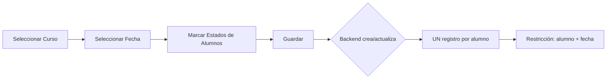

# ✅ RESUMEN COMPLETO - Cambio a Asistencia por Curso

## 📅 Fecha: 31 de Octubre de 2025

---

## 🎯 Cambio Principal

### Antes ❌

- La asistencia se tomaba **POR ASIGNATURA**
- Un alumno podía tener múltiples registros de asistencia por día (uno por cada asignatura)
- Restricción única: `[id_alumno, id_asignatura, fecha]`

### Ahora ✅

- La asistencia se toma **POR CURSO**
- Un alumno tiene UN SOLO registro de asistencia por día
- Restricción única: `[id_alumno, fecha]`
- `id_asignatura` es OPCIONAL (para mantener compatibilidad con datos antiguos)

---

## 📦 Archivos Modificados

### BACKEND (✅ Completado)

1. **`prisma/schema.prisma`**
   - `Asistencia.id_asignatura`: Int → Int? (OPCIONAL)
   - `Asistencia.asignatura`: Asignatura → Asignatura? (OPCIONAL)
   - Unique constraint: `[id_alumno, id_asignatura, fecha]` → `[id_alumno, fecha]`
   - Agregado índice en `id_asignatura`
   - `AsistenciaHistorial.id_asignatura`: Int → Int? (OPCIONAL)

2. **`src/asistencias/dto/create-asistencia.dto.ts`**
   - Agregado `@IsOptional()` a `id_asignatura`
   - Tipo: `number` → `number?`

3. **`src/asistencias/asistencia.service.ts`**
   - **createBulk()**: Actualizado para usar nueva clave única `id_alumno_fecha`
   - **create()**: Actualizado para manejar `id_asignatura` opcional
   - Todas las operaciones ahora usan `any` type para datos con campos opcionales

4. **`prisma/seed/seeds/10-asistencias-conductas-t3.seed.ts`**
   - Cambiado de loop anidado (curso → asignatura → alumno) a loop simple (curso → alumno)
   - Ahora crea UNA asistencia por alumno por día (por curso)
   - Eliminado loop de asignaturas

5. **Migración Aplicada**
   - `20251031161357_asistencia_por_curso`
   - Base de datos actualizada exitosamente ✅

### FRONTEND (✅ Completado)

1. **`src/api/services/asistenciaService.ts`**
   - **CreateAsistenciaDto**: `id_asignatura` ahora opcional
   - **AsistenciaConRelaciones**: `asignatura` ahora opcional/nullable
   - **HistorialAsistenciaResponse**: `id_asignatura` ahora opcional/nullable

2. **`src/components/AsistenciaModuleNew.tsx`**
   - **handleGuardarAsistencia()**:
     - Removida validación de asignatura obligatoria
     - No se envía `id_asignatura` al backend
   - **cargarDatosIniciales()**:
     - Removido filtro `filter((c) => c.asignatura)`
     - Ahora carga TODOS los cursos, no solo los que tienen asignatura
   - **Mensajes actualizados**:
     - "cursos con asignaturas asignadas" → "cursos asignados"

---

## 🔄 Flujo Actualizado

### 1. Tomar Asistencia (Nuevo)



**Request al Backend:**

```typescript
{
  registros: [
    {
      id_alumno: 1,
      // ❌ NO se envía id_asignatura
      id_orientador: 10,
      fecha: '2025-10-31',
      estado: 'P',
      anio_academico: '2025',
      trimestre: 3,
      observacion: null,
    },
  ];
}
```

### 2. Buscar Asistencias

```typescript
// Buscar por curso y fecha
const asistencias = await asistenciaService.buscarConFiltros({
  cursoId: 1,
  fecha: '2025-10-31',
});

// Response incluye asignatura opcional
asistencias.forEach((a) => {
  console.log(a.asignatura?.nombre || 'Asistencia por curso');
});
```

### 3. Editar Asistencia

```typescript
// Actualizar estado (sin necesidad de asignatura)
await asistenciaService.update(asistenciaId, {
  estado: 'E', // Cambiar a Excusado
  observacion: 'Justificado por médico',
});
```

---

## 🧪 Pruebas Realizadas

### Backend ✅

- [x] Compilación exitosa (sin errores de TypeScript)
- [x] Migración aplicada correctamente
- [x] Seed actualizado y ejecutado sin errores
- [x] Prisma Client regenerado

### Frontend ✅

- [x] Interfaces actualizadas (asignatura opcional)
- [x] Lógica de guardado sin `id_asignatura`
- [x] Filtros de cursos sin validar asignatura
- [x] Mensajes actualizados

---

## ⚠️ Consideraciones Importantes

### 1. **Compatibilidad con Datos Antiguos**

Los registros existentes con `id_asignatura` NO se eliminan:

- ✅ Se mantienen en la base de datos
- ✅ Pueden ser consultados normalmente
- ✅ Frontend maneja ambos casos (con/sin asignatura)

### 2. **Restricción de Unicidad**

```sql
-- Ahora solo se permite un registro por alumno por día
UNIQUE (id_alumno, fecha)

-- Antes se permitían múltiples registros por día
-- UNIQUE (id_alumno, id_asignatura, fecha)
```

### 3. **Comportamiento Upsert**

El backend usa `upsert` para evitar duplicados:

```typescript
// Si existe un registro para el alumno en esa fecha:
//   → Se ACTUALIZA el registro
// Si NO existe:
//   → Se CREA uno nuevo
```

### 4. **Seed de Base de Datos**

El seed ahora crea asistencia más realista:

- ✅ Un registro por alumno por día
- ✅ Estados variados (P, E, SP, A)
- ✅ Observaciones realistas

---

## 📊 Impacto en Reportes

### Resumen Mensual (Sin Cambios)

```typescript
// Sigue funcionando igual
const resumen = await resumenService.getResumenMensual({
  cursoId: 1,
  mes: 10,
  anio: 2025
});

// Response:
{
  id_alumno: 1,
  nombre: "Juan",
  apellido: "Pérez",
  justificadas: 2,    // Estado: E
  injustificadas: 1,  // Estado: SP
  atrasos: 3          // Estado: A
}
```

### Resumen Trimestral (Sin Cambios)

```typescript
// Sigue funcionando igual
const resumen = await resumenService.getResumenTrimestral({
  cursoId: 1,
  trimestre: 3,
  anio: 2025,
});
```

---

## 🚀 Próximos Pasos

### Inmediatos (Hoy)

- [x] Verificar compilación de backend
- [x] Verificar compilación de frontend
- [x] Documentar cambios
- [ ] Probar en entorno de desarrollo

### Corto Plazo (Esta Semana)

- [ ] Pruebas E2E completas
- [ ] Verificar todos los reportes funcionan
- [ ] Actualizar documentación de usuario
- [ ] Capacitar a orientadores sobre el cambio

### Mediano Plazo (Próximas 2 Semanas)

- [ ] Monitorear logs de errores
- [ ] Recopilar feedback de usuarios
- [ ] Ajustar UI si es necesario

---

## 📝 Comandos Útiles

### Backend

```bash
# Regenerar Prisma Client
npx prisma generate

# Aplicar migración
npx prisma migrate dev --name asistencia_por_curso

# Resetear base de datos (con seed)
npx prisma migrate reset

# Ver estado de migraciones
npx prisma migrate status

# Ejecutar solo el seed
npx prisma db seed

# Compilar proyecto
npm run build

# Iniciar servidor
npm run start:dev
```

### Frontend

```bash
# Instalar dependencias
npm install

# Verificar tipos TypeScript
npm run type-check

# Compilar proyecto
npm run build

# Iniciar en desarrollo
npm run dev
```

---

## 🐛 Troubleshooting

### Error: "id_asignatura is required"

**Causa**: Frontend sigue enviando `id_asignatura`  
**Solución**: Verificar que se removió `id_asignatura` del objeto de registro

```typescript
// ❌ MAL
const registro = {
  id_alumno: 1,
  id_asignatura: 5, // No enviar esto
  // ...
};

// ✅ BIEN
const registro = {
  id_alumno: 1,
  // id_asignatura se omite
  // ...
};
```

### Error: "Unique constraint failed on [id_alumno, fecha]"

**Causa**: Intentando crear dos registros para el mismo alumno en la misma fecha  
**Solución**: El backend usa `upsert` automáticamente, verifica que estés usando `createBulk()`

### Error: "Cannot read property 'nombre' of null"

**Causa**: Intentando acceder a `asignatura.nombre` cuando es `null`  
**Solución**: Usar optional chaining

```typescript
// ✅ BIEN
asistencia.asignatura?.nombre || 'Por curso';
```

---

## 📚 Documentos Relacionados

1. **CAMBIO-ASISTENCIA-POR-CURSO.md** - Resumen técnico del cambio en backend
2. **CAMBIOS-FRONTEND-ASISTENCIA-POR-CURSO.md** - Guía detallada de cambios en frontend
3. **prisma/migrations/20251031161357_asistencia_por_curso/** - SQL de migración

---

## ✅ Estado Final

| Componente           | Estado           | Verificado |
| -------------------- | ---------------- | ---------- |
| Schema Prisma        | ✅ Actualizado   | ✅         |
| Migración DB         | ✅ Aplicada      | ✅         |
| DTOs Backend         | ✅ Actualizados  | ✅         |
| Service Backend      | ✅ Actualizado   | ✅         |
| Seed                 | ✅ Actualizado   | ✅         |
| Interfaces Frontend  | ✅ Actualizadas  | ✅         |
| Componente React     | ✅ Actualizado   | ✅         |
| Compilación Backend  | ✅ Sin errores   | ✅         |
| Compilación Frontend | ⏳ Por verificar | -          |
| Pruebas E2E          | ⏳ Pendiente     | -          |

---

**Fecha**: 31 de Octubre de 2025  
**Autor**: Sistema de Asistencia CAI  
**Versión**: 2.0 (Asistencia por Curso)  
**Estado**: ✅ Implementación Completada
