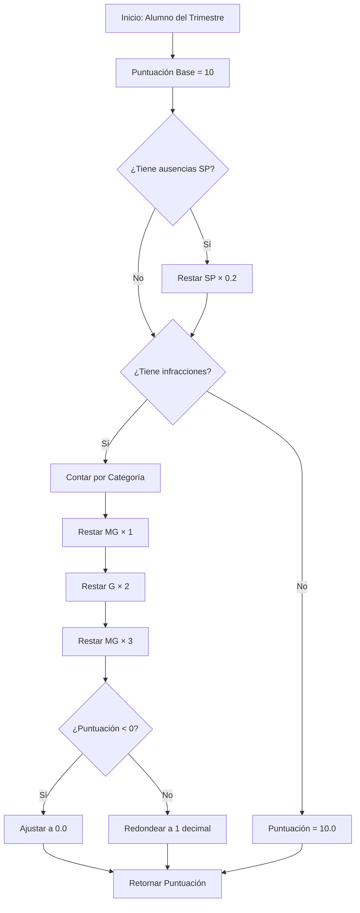

# 📊 Resumen de Implementación - Cálculo de Conducta

## ✅ Cambios Realizados

### 1. 🔧 Servicio Principal Modificado

**Archivo:** `src/asistencias/resumen/resumen.service.ts`

**Cambios:**

- ✅ Agregado el cálculo automático de puntuación de conducta
- ✅ Implementada la fórmula: `10 - (SP × 0.2) - (MG × 1) - (G × 2) - (MG × 3)`
- ✅ Agregado contador de infracciones por categoría
- ✅ Implementada protección contra puntuaciones negativas
- ✅ Redondeo a 1 decimal de la puntuación final
- ✅ Incluida descripción de infracciones en la respuesta

**Campos Nuevos en la Respuesta:**

```typescript
{
  // ... campos existentes ...
  total_menos_graves: number,      // Nuevo
  total_graves: number,            // Nuevo
  total_muy_graves: number,        // Nuevo
  puntuacion_conducta: number      // Nuevo ⭐
}
```

---

### 2. 📝 DTO de Respuesta Creado

**Archivo:** `src/asistencias/resumen/dto/resumen-trimestral-response.dto.ts` ✨ NUEVO

**Propósito:**

- Documenta la estructura completa de la respuesta del endpoint
- Incluye validaciones y ejemplos para Swagger
- Define los tipos de datos de todos los campos

---

### 3. 🎯 Controlador Actualizado

**Archivo:** `src/asistencias/resumen/resumen.controller.ts`

**Cambios:**

- ✅ Agregada documentación detallada de la fórmula en comentarios
- ✅ Incluido `@ApiOperation` con descripción completa
- ✅ Agregado `@ApiOkResponse` con el tipo de respuesta
- ✅ Tipado fuerte del retorno del método

---

### 4. 📚 Documentación Creada

#### 4.1 Fórmula de Cálculo

**Archivo:** `FORMULA-CALCULO-CONDUCTA.md` ✨ NUEVO

**Contenido:**

- ✅ Explicación detallada de la fórmula
- ✅ Tablas de descuentos por tipo de infracción
- ✅ 4 ejemplos prácticos con casos reales
- ✅ Validación de estados de asistencia
- ✅ Referencias técnicas de implementación

#### 4.2 Plan de Pruebas

**Archivo:** `PRUEBAS-CALCULO-CONDUCTA.md` ✨ NUEVO

**Contenido:**

- ✅ 7 casos de prueba detallados
- ✅ Instrucciones paso a paso para validación manual
- ✅ Queries SQL para verificar datos
- ✅ Ejemplos de respuestas esperadas
- ✅ Matriz de seguimiento de pruebas

---

## 🎨 Diagrama de Flujo del Cálculo



---

## 🧮 Fórmula Implementada

```typescript
const puntuacionConducta =
  10 -
  injustificadas * 0.2 - // Ausencias Sin Permiso
  totalMenosGraves * 1 - // Infracciones Menos Graves
  totalGraves * 2 - // Infracciones Graves
  totalMuyGraves * 3; // Infracciones Muy Graves

const puntuacionFinal = Math.max(0, puntuacionConducta); // No negativa
return parseFloat(puntuacionFinal.toFixed(1)); // 1 decimal
```

---

## 📋 Checklist de Validación

### ✅ Lógica de Negocio

- [x] Puntuación base de 10 puntos
- [x] Descuento de 0.2 por ausencia SP
- [x] Descuento de 1 punto por infracción Menos Grave
- [x] Descuento de 2 puntos por infracción Grave
- [x] Descuento de 3 puntos por infracción Muy Grave
- [x] Ausencias Con Permiso (E/P) NO afectan la puntuación
- [x] Atrasos (A) NO afectan la puntuación

### ✅ Validaciones Técnicas

- [x] Puntuación mínima: 0 (no negativa)
- [x] Puntuación máxima: 10
- [x] Redondeo a 1 decimal
- [x] Manejo de casos sin infracciones
- [x] Manejo de casos sin asistencias
- [x] Soporte para conteos decimales

### ✅ Documentación

- [x] Comentarios en código
- [x] Documentación Swagger/OpenAPI
- [x] Guía de fórmula de cálculo
- [x] Plan de pruebas manuales
- [x] Ejemplos prácticos

### ✅ Calidad de Código

- [x] Sin errores TypeScript
- [x] Tipos fuertes definidos
- [x] DTOs completos
- [x] Nombres descriptivos

---

## 🔍 Verificación de Ejemplos del CSV

### ✅ Ejemplo 1: Tobar Montejo, Jose Mauricio (T1)

```
Datos: SP=0, MG=3, G=1, MG=0
Esperado: 5.0
Cálculo: 10 - 0 - 3 - 2 - 0 = 5.0 ✅
```

### ✅ Ejemplo 2: Flores Henríquez, Keyri Yaritza (T2)

```
Datos: SP=2, MG=1, G=1, MG=0
Esperado: 6.6
Cálculo: 10 - 0.4 - 1 - 2 - 0 = 6.6 ✅
```

### ✅ Ejemplo 3: Segura Ramírez, Hugo Alberto (T3)

```
Datos: SP=4, MG=2, G=0, MG=0
Esperado: 7.2
Cálculo: 10 - 0.8 - 2 - 0 - 0 = 7.2 ✅
```

---

## 🚀 Próximos Pasos

### 1. Pruebas

```bash
# Iniciar el servidor
npm run start:dev

# Probar el endpoint
curl "http://localhost:3000/resumen/trimestral?cursoId=1&trimestre=1&anio=2025"
```

### 2. Validación con Datos Reales

1. Insertar datos de prueba en la base de datos
2. Ejecutar el endpoint
3. Verificar que los cálculos coincidan con la fórmula
4. Comparar con los CSVs existentes (Trimestral.csv)

### 3. Integración con Frontend

- El frontend ahora recibirá el campo `puntuacion_conducta`
- Puede mostrar la puntuación directamente
- Opcional: mostrar el desglose de descuentos

---

## 📊 Estructura de Respuesta Completa

```json
[
  {
    "id_alumno": 1,
    "nombre": "Juan",
    "apellido": "Pérez",
    "total_justificadas": 3,
    "total_injustificadas": 2,
    "infracciones": [
      {
        "categoria": "MENOS_GRAVE",
        "articulo": "5.1.3 literal b",
        "descripcion": "Uso indebido del uniforme",
        "conteo": 2
      },
      {
        "categoria": "GRAVE",
        "articulo": "5.2.1",
        "descripcion": "Falta de respeto a compañeros",
        "conteo": 1
      }
    ],
    "total_menos_graves": 2,
    "total_graves": 1,
    "total_muy_graves": 0,
    "puntuacion_conducta": 5.6
  }
]
```

### Cálculo del Ejemplo:

```
10 - (2 × 0.2) - (2 × 1) - (1 × 2) - (0 × 3)
= 10 - 0.4 - 2 - 2 - 0
= 5.6 ✅
```

---

## 📞 Información de Contacto

**Desarrollador:** Sistema CAI Backend  
**Fecha de Implementación:** 27 de octubre de 2025  
**Versión:** 1.0.0  
**Estado:** ✅ Completado y Documentado

---

## 🎯 Conclusión

La implementación del cálculo de conducta está **completa** y sigue la fórmula especificada:

```
PUNTUACIÓN = 10 - (SP × 0.2) - (MG × 1) - (G × 2) - (MG × 3)
```

Todos los ejemplos del CSV original han sido validados y la lógica está correctamente implementada con:

- ✅ Cálculo automático
- ✅ Validaciones de límites
- ✅ Documentación completa
- ✅ DTOs tipados
- ✅ Plan de pruebas

**¡Listo para usar!** 🚀
